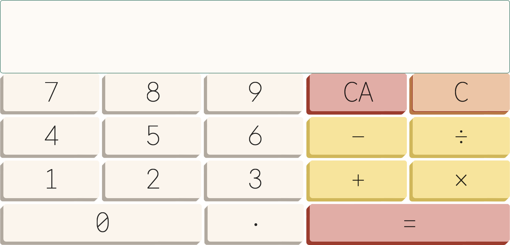

<h1> Calculator </h1>

## Overview

Designed with simplicity in mind, this app aims to provide a basic yet functional tool for performing arithmetic calculations.

## How to Contribute

Contributions are always welcome. Please follow the steps below for your pull request.

1. Fork this project to your account
2. Create a branch for the change you are proposing
3. Apply changes to your fork
4. Send a pull request after referring to the **[contributing guidelines](https://github.com/ycaglar/.github/blob/master/CONTRIBUTING.md)**
